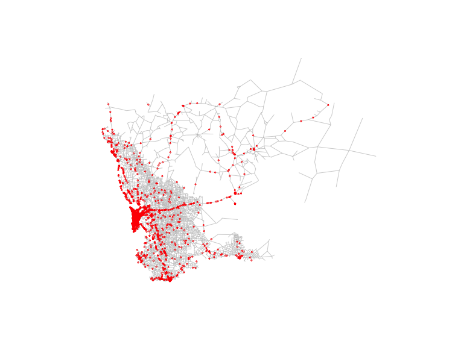
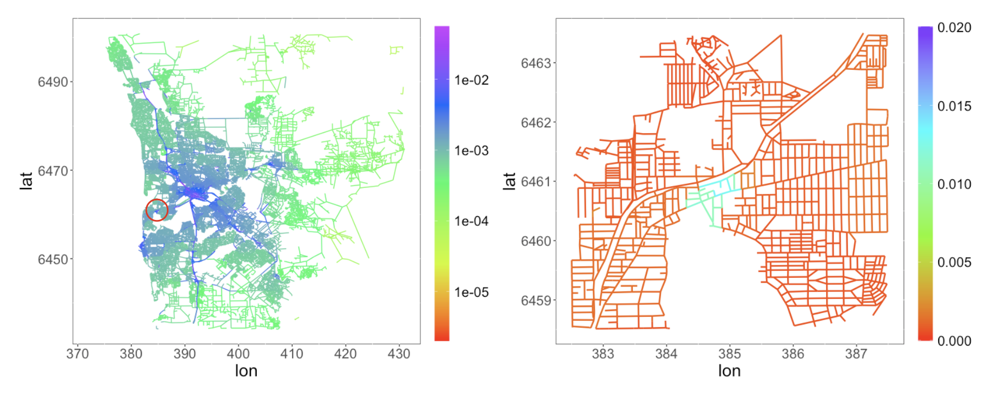

# Intensity Estimation on Linear Networks
Research Project;

Project Status: Completed;

Introduction to the paper "Risk Based Arsenic Rational Sampling Design for Public andEnvironmental Health Management",

which is under review in *Journal of Computatioanl and Graphic Statistics*

Auther: Lihao Yin(the first auther), Huiyan Sang;

key words: Graph regularization, Line network, Spatial Point Pattern, Varying coefficient models, Intensity Estimation;

## Abstract
The availability of large spatial data geocoded at accurate locations has fueled a growing interest in spatial modeling and analysis of point processes.  The proposed research is motivated by the intensity estimation problem for large spatial point patterns on complex domains, where many existing spatial point process models suffer from the problems of "leakage" and computation. We propose an efficient intensity estimation algorithm to estimate the spatially varying intensity function and to study the varying relationship between intensity and explanatory variables on complex domains. The method is built upon a graph regularization technique and hence can be flexibly applied to point patterns on complex domains such as regions with irregular boundaries and holes, or linear networks. An efficient proximal gradient optimization algorithm is proposed to handle large spatial point patterns.  We also derive the asymptotic error bound for the proposed estimator. Numerical studies are conducted to illustrate the performance of the method.  Finally,  We apply the method to study and visualize the intensity patterns of the accidents on the Western Australia road network,  and the spatial variations in the effects of income, lights condition, and population density on the Toronto homicides occurrences.
 
 ## Brief Introduction to the Project
 ### Data Description

The Figure below shows the road structure in the state of Western Australia and the locations of 14,562 traffic accidentsin 2011;
 
 
 ### Project Aim
 To detect the propability of event occurrence on linear network structure;
 
 To apply the proposed method to investigate the occurrence of traffic accidents along the road networks;
 
 ### Methodology
 Proposed a Poisson regression model with spatially varying parameters, to model the intensity functions on linear networks;
 
 Proposed a optimization problem with graphic fused Lasso penaly to fit the proposed model;
 
 Implemented the graph decomposition and consensus ADMM algorithm to solve the proposed optimization problem; 
 
 
 ### Results
 
 The Figure below show the estimated risk (intensity function) of traffic accidents along the road in the state of Western Australia;
 
